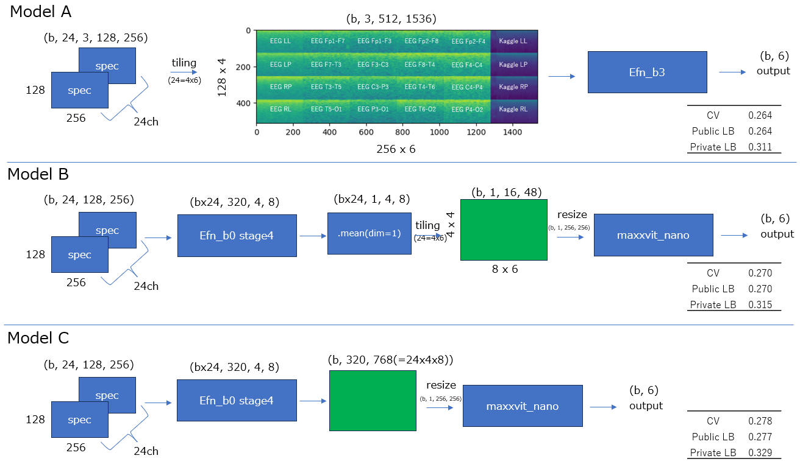

# HMS - Harmful Brain Activity Classification 5th place solution(kazumax part)
This is the source code for the kazumax part of 5th place solution to the kaggle [HMS - Harmful Brain Activity Classification](https://www.kaggle.com/competitions/hms-harmful-brain-activity-classification)

## kazumax part Solution Overview


## Solution Detais
Please read [this post](https://www.kaggle.com/competitions/hms-harmful-brain-activity-classification/discussion/492652) on Kaggle Discussion.

## Hardware
I used NVIDIA DGX Station V100.

## Requirement
I recommend using docker.  
[requirements.txt](./requirements.txt)

## How to use

### Build docker
```
$ docker build ./docker -t kaggle:hms
```

### Data download
* competition data  
    * Please download competition data from [kaggle](https://www.kaggle.com/competitions/hms-harmful-brain-activity-classification/data) and put them to ```./data``` and unzip them.
* preprocessed data  
    * Please download data preprocessed data by [Chris Deotte](https://www.kaggle.com/cdeotte) from [kaggle](https://www.kaggle.com/datasets/cdeotte/brain-spectrograms) and put them to ```./data``` and unzip them.
    * move ```specs.npy``` to ```./data/generated```.

### Make spectrograms from eeg data
```
$ python src/utils/make_eeg_specs_offset.py
```
```./data/generated/eeg_specs``` will be created.

### Train 1st stage
```
$ ./run_1st_stage.sh
```
This command trains 3 models(modelA/B/C) with 4 fold using all data.  
checkpoint will be saved at ```./wandb```

### Train 2nd stage
Open ```./run_2nd_stage.sh``` and replace ```<write path to the 1st_stage-fold_X-model_Y>``` with the appropriate path.
```
$ ./run_2nd_stage.sh
```
This command trains 3 models(modelA/B/C) with 4 fold using high vote(vote>=10) data.  

### Inference for Out-of-fold data.
Open ```./config/config_inference_oof.yml``` and replace 
* ```<write path to the 2nd_stage-fold_X-model_Y>``` with the appropriate path
* ```<write model_A or model_B or model_C>``` with the appropriate one. Output file will be created at ```./output/<modelA or model_B or model_C>```
```
$ python src/inference.py -c config/config_inference_oof.yml
```
This command inference for Out-of-fold data.
* ```./output/oof/<model_A or model_B or model_C>/prediction.csv``` is a file containing probabilitis and logits.
* ```./output/oof/<model_A or model_B or model_C>/submission.csv``` is a file in submission format.

### Inference for new test set.
Open ```./config/config_inference_new_test_set.yml``` and replace 
* ```<write path to the 2nd_stage-fold_X-model_Y>``` with the appropriate path
* ```<write path to the CSV that lists the sample information for the new_test_set>``` with the appropriate path
```
$ python src/inference.py -c config/config_inference_new_test.yml
```
This command inference for new test set data.
* ```./output/test_set/prediction.csv``` is a file containing probabilitis and logits.
* ```./output/test_set/submission.csv``` is a file in submission format.


## Note
* If you want to change training setting, please revise yml file in ```./configs``` directory.
* [Weight & Biases](https://www.wandb.com/) is used for visualization of results.